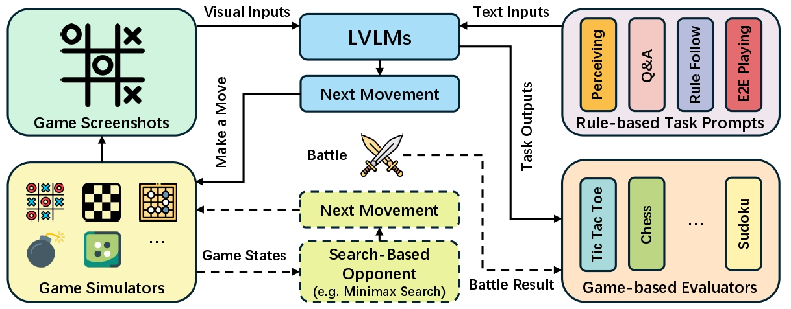

<div align="center">

<h1>👾Are Large Vision Language Models Good Game Players?</h1>

<div>
    <a href='https://github.com/xinke-wang' target='_blank'>Xinyu Wang<sup>🎮</sup></a>;
    <a href='https://bohanzhuang.github.io/' target='_blank'>Bohan Zhuang<sup>🕹️</sup></a>;
    <a href='http://www.qi-wu.me' target='_blank'>Qi Wu<sup>🎮</sup></a>
</div>
<sup>🎮</sup>The University of Adelaide <sup>🕹️</sup>Zhejiang University

<br>

<div>
    <a href='https://openreview.net/pdf?id=c4OGMNyzPT'></a>
    <a href="https://opensource.org/licenses/MIT"></a>
</div>

</div>



LVLM-Playground is a benchmark to evaluate Large Vision Language Models (LVLMs) on game-playing tasks, assessing their perception, reasoning, and decision-making across six classic games. This repository provides tools to run experiments, analyze performance, and visualize results. For further details, please refer to our paper [here](https://openreview.net/pdf?id=c4OGMNyzPT).

## News

\[**2025.Mar**\] LVLM-Playground is released! 🚀 <br>
\[**2025.Feb**\] LVLM-Playground has been accepted to ICLR 2025! 🎉 Check the paper [here](https://openreview.net/pdf?id=c4OGMNyzPT).

## Installation

1. **Clone the Repository**:

   ```bash
   git clone https://github.com/xinke-wang/LVLM-Playground.git
   cd LVLM-Playground
   ```

2. **Setup a Conda Environment**

   ```bash
   conda create -n playground python=3.11 -y
   conda activate playground
   pip install -r requirements.txt
   ```

3. **Install Stockfish for Chess**

   To run experiments on Chess, you need to install Stockfish.

   - With `sudo` privileges, install [Stockfish](https://stockfishchess.org/) via your package manager:

     ```bash
     sudo apt-get install stockfish
     ```

   - Alternatively, you can download the latest Stocfish binary from [stockfishcess.org](https://stockfishchess.org/download/).

   - Extract the binary and place the `stockfish` executable in your system PATH or the project directory.

## Data Preparation

1. **Download Pre-generated Benchmark Data**:

To facilitate reproducibility of the experiments in our paper, we provide pre-generated benchmark data. You can download the data by running the following command:

```bash
wget https://universityofadelaide.box.com/shared/static/9xx4brpiipqmmyomau2v522frtijx930.zip -O benchmark.zip
unzip benchmark.zip -d .
```

After unzipping, you should have the following directory structure:

```
LVLM-Playground
├── benchmark
│   ├── perceive
│   │   ├── chess
│   │   │   ├── 0000000.jpg
│   │   │   ├── 0000001.jpg
│   │   │   ├── ...
│   │   │   └── annotation.json
│   │   ├── gomoku
│   │   ├── minesweeper
│   │   ├── reversi
│   │   ├── sudoku
│   │   └── tictactoe
│   ├── qa
│   └── rule
```

2. **Generating a Custom Benchmark (Optional)**:

Alternatively, you can generate a new benchmark dataset by running the following command:

```bash
python generate_benchmark.py
```

You can modify the `configs/base.py` file to customize the benchmark generation process.

```python
# configs/base.py
benchmark_setting = dict(
   games=['tictactoe', 'gomoku', 'minesweeper', 'reversi', 'sudoku', 'chess'],
   sample_size=2000,
   e2e_round=100,
   offline_task=['perceive', 'qa', 'rule'],
   benchmark_path='benchmark'
)
```

- Adjust `games` to include or exclude specific games.
- Modify `sample_size` to control the number of samples per game.
- Change `benchmark_path` to specify the output directory.

## Running Experiments

Once the data is ready, run experiments using:

```bash
python run.py --exp-recipe configs/recipe/base.py --agent-cfg configs/agents/internvl/internvl2-1b.py
```

`--exp-recipe` specifies the experiment settings, and `--agent-cfg` specifies the agent configuration. If you are using the commercial model (e.g., OpenAI, Google, Anthropic) as agent, ensure you have the necessary API keys set as environment variables (e.g., `OPENAI+API_KEY`, `GOOGLE_API_KEY`). The framework can **automatically resume** the experiment from unexpected termination, as long as you set the same experiment name in the experiment recipe config (`configs/recipe/base.py`).

We provide several pre-defined agent configurations in the `configs/agents` directory, includes three widely used commercial APIs [Gemini](configs/agents/google), [Claude](configs/agents/anhthropic), and [ChatGPT](configs/agents/openai), as well open-source models supported by [LMDeploy](https://github.com/InternLM/lmdeploy). You can find the pre-set configurations in `configs/agents`, and modify them to customize the LVLM settings.

You can customize the experiment settings by modifying the configuration file `configs/recipe/base.py`.

```python
# configs/recipe/base.py
name = 'standard'
save_path = 'experiments'
tasks = ['perceive', 'qa', 'rule', 'e2e']
games = ['tictactoe', 'reversi', 'gomoku', 'minesweeper', 'sudoku', 'chess']
```

- Adjust `tasks` to include or exclude specific tasks.
- Modify `games` to specify the games to evaluate.
- Change `save_path` to specify the output directory.
- Set `name` to identify the experiment.

## Evaluating Results

Once you have run the experiments, the results will be saved in the `experiments` directory with a name specified in the experiment recipe. You can evaluate the results using:

```bash
python evaluate.py --exp-path experiments/standard/gpt4o.json
```

Evaluation results will be saved by default in the `evaluation_results/` directory.

## Visualizing Results

To visualize the evaluation results, generate a radar chart comparing LVLMs across tasks:

```bash
python plot_radar.py
```

This will automatically create a radar chart (`radar_chart.pdf`) in the current directory, illustrating performance differences.

To compare with the results in our paper, you can download the evaluation files from [here](https://universityofadelaide.box.com/s/tn398x5zyj5eq0e05atfcja40w1xdf83) and place them in the `evaluation_results` directory. This includes the evaluation results for [GPT-4o-240806](https://openai.com/index/gpt-4o-system-card/), [Gemini-1.5pro](https://blog.google/technology/ai/google-gemini-next-generation-model-february-2024/), [Claude-3.5-sonnet](https://www.anthropic.com/news/claude-3-5-sonnet), [Qwen2-vl-7b](https://huggingface.co/Qwen/Qwen2-VL-7B), [DeepSeek-vl-7b](https://huggingface.co/deepseek-ai/deepseek-vl-7b-base), [Phi3-vl](https://huggingface.co/microsoft/Phi-3-vision-128k-instruct), [LLaVA-1.6-7b](https://huggingface.co/liuhaotian/llava-v1.6-vicuna-7b), and [InternVL2-8b](https://huggingface.co/OpenGVLab/InternVL2-8B).


## Evaluating Customized Models

To evaluate a customized LVLM, follow these steps:

1. **Implement Your Model**:

   Implement your model by inheriting the `BaseAgent` class in `agents/base_agent.py`, and registering it with `AGENT_REGISTRY`. You may use the following template:

   ```python
   from playground.agents import BaseAgent
   from playground.registry import AGENT_REGISTRY

   @AGENT_REGISTRY.register('custom_single')
   class CustomAgentSingleStep(BaseAgent):

      def __init__(self, agent_cfg):
         super().__init__(agent_cfg)
         # Initialize your model, API, or configuration here
         pass

      def get_decision(self, screenshot_path: str, prompt: str):
         # Implement logic to process the screenshot and prompt, return a decision
         pass
   ```

2. **Configure Your Model in** `configs/agents`:

   Create or modify a configuration file (e.g., configs/agents/custom_agent.py) to define your model’s settings. Example:

   ```python
   lmm_agent = dict(
      agent='custom_single',
      model='your_model_name',
      max_tokens=512,
      image_size=512,
      backend_config=None,
      general_config=None,
      name='custom_agent'
   )
   ```

   Ensure the `agent` field matches the registered name in the `AGENT_REGISTRY`. After defining and configuring your model, follow the standard steps to run experiments (`python run.py`), evaluate results (`python evaluate.py`), and visualize performance (`python plot_radar.py`).

## Acknowledgements

We acknowledge the authors of the following repositories for providing the game UIs and search-based AI implementations:

- [Python-Chess](https://github.com/niklasf/python-chess)
- [Moonsweeper](https://www.pythonguis.com/examples/python-minesweeper/)
- [Sudoku-in-Python](https://github.com/humzah286/Sudoku-in-python)
- [Gobang](https://github.com/sgsx11/Gobang)
- [GUI-tic-tac-toe-AI](https://github.com/Erfan-ram/GUI-tic-tac-toe-Ai)
- [reversi-minimax-algorithm](https://github.com/abkhan04/reversi-minimax-algorithm)


## Contact

If you have any questions or suggestions, please feel free to open an issue or contact us via email Xinyu Wang [xinyu.wang02@adelaide.edu.au](mailto:xinyu.wang02@adelaide.edu.au).

## Citation

If you find this repository useful for your research, please consider citing our paper:

```bibtex
@inproceedings{wang2025large,
  title={Are Large Vision Language Models Good Game Players?},
  author={Wang, Xinyu and Zhuang, Bohan and Wu, Qi},
  booktitle={International Conference on Learning Representations},
  year={2025}
}
```
